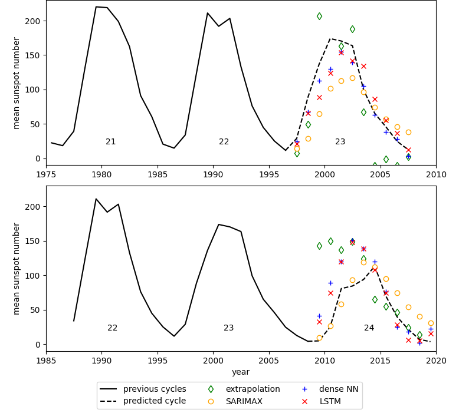

Forecasting sunspot numbers with machine learning.

The data of sunspot numbers is published by the WDC-SILSO, Royal Observatory of Belgium, Brussels. See here: https://www.sidc.be/SILSO/datafiles.

Predictions of the mean annual sunspot numbers for solar cycles 23 and 24 by different (so far simple) models. Lines are the actual measurements and symbols are the model predictions:
- A linear extrapolation from the values 11 and 22 years ago
- A SARIMAX(2,0,1) model
- A neural network with one hidden, dense layer
- A neural network with one LSTM layer

This figure was created by using *plotting.plot_annual_example()*.